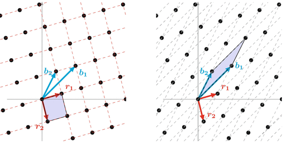
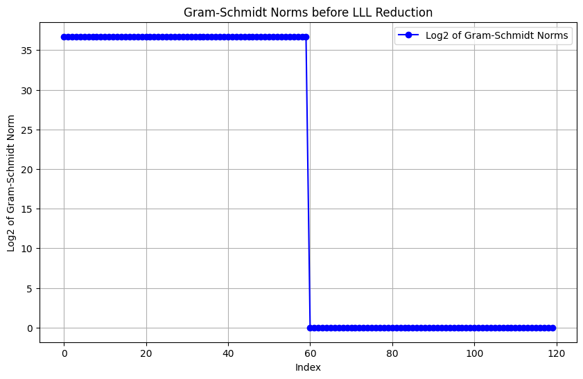
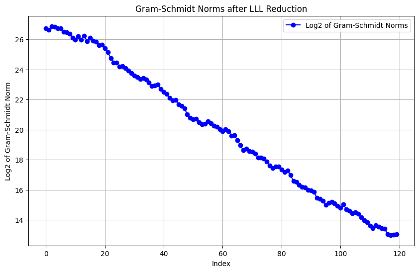

# Lattice reduction

Lattice reduction algorithms such as LLL and BKZ make iterative local improvements to a basis. This means that the global cost can be seen as two-folds: how costly is it to make the local improvements, which corresponds to solving an exact SVP problem and how costly is the global behavior of the algorithm. This section focuses on the global behavior of lattice reduction algorithms, while the next section (Cost models) will focus about solving local improvements.

## Useful quantities in lattices 

### Volume

In each lattice, we can define the volume of the lattice as the volume of its fundamental parallellepiped (the area delimited by the basis vectors). This quantity is an invariant of the lattice and does not depend on the basis chosen. This means that by applying Gram-Schmidt orthogonalization to any basis will give us an orthogonal basis from which we can approximate the volume of the lattice as 

$$ Vol(\Lambda) =  \prod_{i=0}^{d-1} \lVert \bold{b_i}^*\rVert $$

where $\bold{b_i}*$ are the orthogonal Gram-Schmidt vectors. It is also important to remember that $Vol(\Lambda) = |Det(\bold{B})|$, where $\bold{B}$ is the basis matrix.

This invariant is conceptually important because it tells us that not all basis vectors can be small at the same time.

### Gaussian heuristic

The gaussian heuristics predicts the number of lattice points inside any measurable body $\mathcal{B} \subset \mathbb{R}^d$ is approximately $\frac{Vol(\mathcal{B})}{Vol(\Lambda)}$. Applied to an euclidean d-ball, this would give that the length of the first vector is approximately 

$$\lambda_1(\Lambda) \approx (\frac{Vol(\mathcal{B})}{Vol(\Lambda)})^{\frac{1}{d}} \approx \sqrt{\frac{d}{2\pi e}} Vol(\Lambda)^{\frac{1}{d}}$$

## LLL algorithm

The Lenstra-Lenstra-Lovász (LLL) algorithm is an efficient polynomial-time algorithm in lattice theory that finds a "nearly orthogonal" basis for a given lattice. It aims to transform any arbitrary basis of a lattice into a reduced basis where the basis vectors are short and close to orthogonal following two conditions:

1. Size reduction:
$$1 \leq j < i \leq n\colon \left|\mu_{i,j}\right|\leq 0.5 \text{ for } \mu_{i,j} =\frac{\langle\mathbf{b}_i,\mathbf{b}^*_j\rangle}{\langle\mathbf{b}^*_j,\mathbf{b}^*_j\rangle}$$
2. Lovász condition:
For $k=2,...,n$ $$\delta \Vert \mathbf{b}^*_{k-1}\Vert^2  \leq \Vert \mathbf{b}^*_k\Vert^2+ \mu_{k,k-1}^2\Vert\mathbf{b}^*_{k-1}\Vert^2$$

We say the basis is LLL-reduced if there exists a parameter $\delta \in (0.25, 1)$. 

While there exists some theorems bounding the worst cases of lattice reduction algorithms, they tend to perform better in practices. Reasoning about the behaviors of such algorithms has therefore become a game of heuristics and approximations. Typically, the vectors that are outputed by the LLL algorithm are said to follow the geometrie series assumption in their length. This assumption tells us that the shape after lattice reduction is a line with a flatter slope as lattice reduction gets stronger. The goal of lattice reduction algorithm can therefore be interpreted seen by watching a graph of the log-length of vectors after reductions. The overall goal being to flatten the line, leading to a small basis.

## BKZ algorithm

The Block Korkine-Zolotarev (BKZ) algorithm is a lattice reduction algorithm that generalizes the LLL algorithm to achieve stronger reduction properties. The BKZ algorithm is defined as a blockwise reduction algorithm that iteratively applies a form of lattice basis reduction to overlapping blocks of vectors within the basis. Assuming we have an SVP oracle, the BKZ algorithm is defined as follows: 

    Data: LLL-reduced basis B (pre-processed) and block size beta
    repeat until np changes
        for k in 0 to d-1
            LLL on local projected block [k, ..., k+beta-1]
            v <-- SVP-Oracle(local projected block[k, ..., k+beta-1])
            insert v into B
        end

A BKZ-$\beta$ reduced basis satisfies, for $\epsilon > 0$:

$$\lVert \bold{b_0} \rVert \leq \sqrt{(1 + \epsilon) \gamma_{\beta}}^\frac{d-1}{\beta - 1} Vol(\Lambda(\bold{B}))$$

, where $$\gamma_\beta =  \sup \{ \lambda_1(\Lambda) | \Lambda \in \mathbb{R}^\beta, Vol(\Lambda) = 1 \}$$

is the hermite constant

### GSA assumption and root hermite factor

By combining the gaussian heuristic and the definition of a BKZ-$\beta$ reduced basis, we arrive at the well-known *geometric series assumption* (GSA), which states that in a lattice of dimension $d>>\beta$, the length of reduced vectors follow a geometric series (which we can plot as a line as we did for LLL).

We can write

$$\log(\lVert \bold{b_i}^*\rVert) = \frac{d - 1 - 2i}{2}\log(\alpha_\beta) + \frac{1}{d}\log(Vol(\Lambda))$$

where $\alpha_\beta$ is the slope under the geometric assumption that can be calculated from the gaussian assumption as 

$$\alpha_\beta = \sqrt{\frac{d}{2\pi e}}^\frac{2}{\beta - 1}$$

We will next want to introduce a value called the *root hermite factor*. It is a measure used in lattice reduction theory to evaluate the quality of a reduced lattice basis. It is commonly used to assess the effectiveness of lattice reduction algorithms. It quantifies how much longer the shortest vector in a reduced lattice basis is, compared to the length of an ideal shortest vector, scaled by the lattice dimension. Formally we define it as

$$\lVert \bold{b_0} \rVert = \delta Vol(\Lambda)^\frac{1}{n}$$ for an n-dimensional matrix.

The closer $\delta$ gets to 1, the better the reduction will be. This is of direct impact in our context, since the quality of the reduction will depend on the block-size decided for BKZ. Specifically, we can write for SIS:

$$\delta_\beta = \frac{1}{\sqrt{\alpha_\beta}}$$

$$\lVert \bold{b_0} \rVert \approx \delta_\beta^{d-1} Vol(\Lambda)^{\frac{1}{d}}$$

### Further improvements

However, it has been showed in practice that the GSA assumption is a lie. In reality it behaves differently at its tail and this behaviour can be simulated. Also, a lot of tweaks, additions and speed up have been introduced into plain BKZ leading to BKZ 2.0, which provides a stronger reduction.

## Costing the overall BKZ behavior

We 